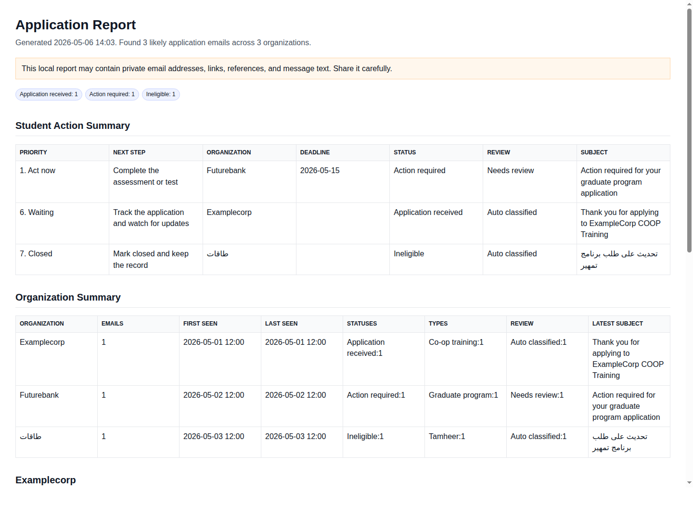

# Inbox Report

Turn local mailbox exports into simple application reports for students and early-career applicants.

Inbox Report reads `.mbox` and `.eml` exports, detects likely job, COOP, internship, Tamheer, and training application emails, then writes CSV, HTML, and optional PDF reports.

No inbox login. No email password. No cloud upload. No external API. No LLM.

## Watch The Demo


Autoplay preview above. Prefer video controls? [Watch the MP4](docs/assets/mara-inbox-report-demo.mp4). The generated report looks like this:



## Quick Start

```bash
git clone https://github.com/mara-org/inbox-report.git
cd inbox-report
python3 inbox_application_reporter.py demo
```

That creates a fake mailbox and demo reports under `.demo/`.

For a real Gmail export:

```bash
python3 inbox_application_reporter.py report /path/to/Takeout/Mail --open
```

For a single MBOX file:

```bash
python3 inbox_application_reporter.py report /path/to/Mail.mbox --open
```

For a folder of EML files:

```bash
python3 inbox_application_reporter.py report /path/to/eml-folder --open
```

If the report is empty but you expected applications, run audit mode:

```bash
python3 inbox_application_reporter.py audit /path/to/Mail.mbox --open
```

Prefer questions instead of flags:

```bash
python3 inbox_application_reporter.py wizard
```

## Use With An Agent

Want Codex, Claude Code, Cursor, or another local agent to run it for you? Give it [AGENT_HANDOFF.md](AGENT_HANDOFF.md). The handoff prompt tells the agent to run the demo, ask for your local export path, generate the report, and avoid passwords or uploads.

## Outputs

- `student_summary.csv`: next-step list sorted by action priority.
- `applications.csv`: detailed matched emails.
- `applications_summary.csv`: organization-level counts.
- `applications_report.html`: browser report.
- `applications_report.pdf`: PDF report when optional PDF dependencies are installed.

Use redacted mode before sharing reports:

```bash
python3 inbox_application_reporter.py redact /path/to/Mail.mbox --open
```

## Install

Python 3.9+ is supported. The CSV and HTML flow uses the Python standard library, so direct script usage works without installing runtime packages.

Optional package install:

```bash
python3 -m pip install "inbox-report[pdf]"
inbox-report --version
```

Local development:

```bash
python3 -m pip install -e ".[pdf]"
python3 -m pip install -r requirements-dev.txt
make check
```

## More

- [Quickstart For Students](QUICKSTART.md)
- [Agent Handoff](AGENT_HANDOFF.md)
- [Export Guide](docs/export-guide.md)
- [How It Works](docs/how-it-works.md)
- [PyPI Publishing](docs/pypi-publishing.md)
- [Contributing](CONTRIBUTING.md)

Mailbox exports and generated reports can contain sensitive personal data. Keep real `.mbox`, CSV, HTML, and PDF files private unless you intentionally redact and share them.

## About

This project is maintained under the [mara](https://github.com/mara-org) on GitHub.

Created by [@gqnxx](https://github.com/gqnxx) · Improved by [@justAbdulaziz10](https://github.com/justAbdulaziz10)
